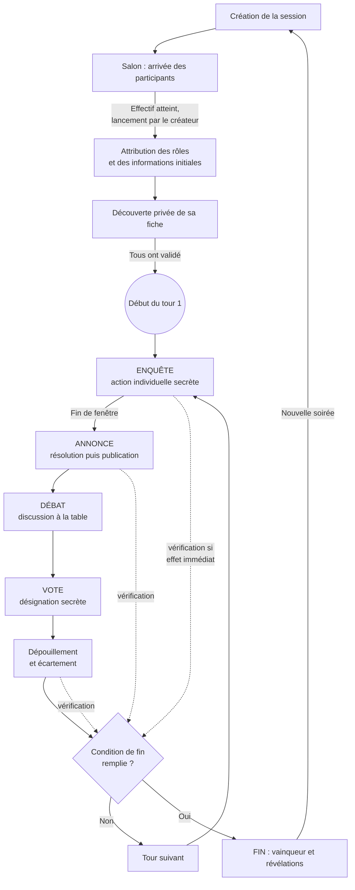

# Boucle de gameplay

Ce document décrit la logique **dynamique** du jeu : ce qui se passe, dans quel ordre, déclenché par quoi, et ce qui peut bloquer.

Il décrit la **mécanique capable d'accueillir les règles**, pas chaque exception de chaque rôle. Les cas particuliers sont dans [roles-reference.md](roles-reference.md).

---

## 1. Vue d'ensemble

La vérification des conditions de fin n'a pas lieu qu'en bas de boucle : elle est déclenchée **à chaque changement d'état significatif**, ce qui permet à une partie de se conclure au milieu d'un tour.

---

## 2. Préparation d'une session

**Déclencheur** — un participant crée la session et choisit le mode (avec ou sans meneur).

**Ce qui est produit** — une session identifiée par un **code court**, qui est le seul élément à transmettre aux autres. Les paramètres par défaut sont posés : durée de chaque phase, composition selon l'effectif.

**Paramétrage disponible avant lancement** — durée des phases, ajustement du vivier de rôles (forcer la présence d'un rôle, en bannir un autre), variante de mécanique de vote. Trois rôles ne sont jamais bannissables : ils garantissent qu'une partie contient toujours au minimum une menace offensive, une protection et une investigation forte.

**Ce qui peut bloquer** — rien à ce stade.

---

## 3. Arrivée et validation des participants

**Déclencheur** — un participant saisit le code de la session et un pseudonyme.

**Qui peut agir** — n'importe qui disposant du code. Aucun compte, aucune authentification, aucune installation. **Un participant doit pouvoir entrer en jeu en moins d'une minute**, sur son propre téléphone.

**Informations nécessaires** — le code, un pseudonyme court.

**Ce qui modifie l'état** — la liste des présents, visible en direct par tous les participants déjà dans le salon.

**Ce qui permet de continuer** — le créateur lance la partie. Condition : **l'effectif présent doit correspondre exactement à la cible choisie**, entre 6 et 20. Un meneur éventuel n'est pas compté dans cet effectif.

**Ce qui peut bloquer** — le créateur quitte le salon. En l'état, personne d'autre ne peut lancer la partie et il n'existe aucun mécanisme de reprise automatique du rôle de lanceur. *Manque identifié.*

**Point important : l'arrivée tardive est refusée.** Une fois la session lancée, l'entrée d'un nouveau participant est explicitement rejetée. Le seul chemin autorisé est la **reconnexion d'un participant déjà membre**, qui retrouve exactement sa place et son état.

---

## 4. Lancement et attribution des informations privées

**Déclencheur** — le lancement par le créateur.

**Ce qui se produit, dans l'ordre :**

1. **Tirage de la composition.** Les proportions par famille sont dérivées de l'effectif. Les emplacements garantis sont pourvus en premier, puis les emplacements souples sont tirés selon des motifs et des pondérations. Contraintes respectées : pas de doublon, respect des seuils d'effectif minimum propres à certains rôles, exclusion des rôles bannis et des rôles émergents.
2. **Attribution privée.** Chaque participant reçoit son rôle. **Personne d'autre ne le connaît**, à l'exception des membres de la minorité informée qui se connaissent mutuellement, et du meneur qui voit tout.
3. **Effets de setup.** Certains rôles reçoivent immédiatement de quoi jouer : un objet, une désignation imposée, un choix initial à faire, ou la connaissance d'un allié.
4. **Distribution des informations d'amorçage.** Environ un participant sur trois reçoit une information **véridique** sur la composition de *cette* partie. Points de conception importants :
   - la distribution est **aveugle à l'appartenance** — les membres de la minorité informée en reçoivent aussi, ce qui leur fournit une couverture crédible ;
   - **aucune information d'amorçage n'est fausse.** Le mensonge, dans ce jeu, vient des joueurs et des capacités, jamais du système au moment du setup ;
   - une variante existe : une information peut être **coupée en deux moitiés illisibles séparément**, remises à deux participants différents. La recomposition n'est pas assistée par l'application — **elle se fait à la table, oralement**, ce qui force la prise de parole et le risque de se découvrir. C'est un excellent exemple de la philosophie du produit : *l'application crée la situation, la table la résout.*

**Ce qui peut bloquer** — l'effectif ne correspond pas à la cible.

---

## 5. Découverte de la fiche

**Déclencheur** — l'attribution est faite.

**Ce qui se passe** — chaque participant lit sa fiche privée : rôle, appartenance, objectif, capacité, limites d'usage, informations initiales. Ce moment n'est **pas chronométré** : découvrir son rôle est un moment d'appropriation qui ne doit pas être bousculé.

**Ce qui permet de continuer** — **tous** les participants ont validé leur fiche. Le chronomètre démarre alors et le tour 1 commence.

**Ce qui peut bloquer** — **c'est le point de blocage le plus concret du produit.** Un seul participant qui ne valide jamais (téléphone posé, application fermée, joueur parti aux toilettes) gèle la session pour tout le monde. Aucun délai limite, aucun forçage, et aucun avancement automatique ne s'applique tant que la partie n'est pas officiellement démarrée. *Manque identifié, à traiter dans toute conception future.*

---

## 6. Phase d'Enquête — l'action secrète

**Déclencheur** — début du tour.

**Durée** — configurable, de l'ordre de trente secondes par défaut.

**Qui peut agir** — tout participant **actif** (vivant et non écarté).

**Ce qu'un participant peut faire :**

- **utiliser sa capacité**, généralement en désignant une ou deux cibles ;
- **utiliser un objet** de son inventaire, indépendamment de sa capacité ;
- **prendre des notes privées** et marquer d'autres participants sur un tableau de suspicions personnel ;
- **rédiger son testament** (message visible après sa mort) ;
- **répondre à une sollicitation** privée reçue d'un autre rôle ;
- **communiquer** dans les canaux auxquels il a droit.

**Point de conception majeur : toutes les capacités actives se jouent ici.** Aucune capacité ne s'exerce pendant le débat ou le vote. Cette unification est le résultat d'une refonte : elle simplifie énormément le modèle mental du joueur (« mon moment d'agir, c'est l'Enquête ») et concentre toute la complexité de résolution en un seul endroit.

**Informations nécessaires au joueur** — la liste des cibles éligibles, l'état de son quota, et le fait de savoir si sa capacité est disponible ce tour-ci.

### Le cycle de vie d'une action

Une action passe par trois états conceptuellement distincts :

| État | Signification |
|---|---|
| **Choisie** | Le joueur a désigné sa cible dans l'interface, sans avoir validé |
| **Acceptée** | L'action est enregistrée : préconditions et quotas validés, quota consommé |
| **Résolue** | L'effet est calculé et appliqué, à l'Annonce |

**Comportement actuel, à connaître :** l'acceptation est **immédiate et irréversible**. Il n'existe aucun moyen de retirer ou de modifier une action une fois validée, et le quota est consommé à la validation même si l'action échoue ensuite à la résolution. C'est une asymétrie assumée avec le vote, qui lui reste modifiable jusqu'à la clôture.

Cette irréversibilité est probablement délibérée (elle rend la décision engageante), mais elle n'est pas formalisée comme une règle, et la documentation interne décrit parfois un modèle plus souple. *À trancher.*

**Résolution différée.** Une action acceptée pendant l'Enquête **ne produit aucun effet visible pendant l'Enquête**. Elle est mise en attente et ne se résout qu'au basculement vers l'Annonce. C'est ce qui garantit que personne ne peut déduire d'un changement d'état ce qu'un autre a fait.

**Actions à effet retardé.** Un sous-ensemble de capacités se joue pendant l'Enquête mais **ne produit son effet qu'au tour suivant**. Conséquence directe : ces rôles ne peuvent rien faire d'utile au premier tour.

**Si un participant ne joue pas** — sa capacité est simplement perdue pour le tour. Aucune sanction, aucun blocage. **Exception** : une poignée de rôles doivent impérativement faire un choix initial ; si le joueur ne le fait pas, le système **choisit à sa place** juste avant la fin de la phase, pour éviter qu'un rôle reste inerte toute la partie.

**Ce qui peut bloquer** — rien. La phase se termine au chronomètre quoi qu'il arrive.

---

## 7. Résolution — le cœur du moteur

**Déclencheur** — la fin de la fenêtre d'Enquête.

C'est le moment le plus délicat du produit. Toutes les actions du tour sont résolues **d'un bloc**, de façon ordonnée et impartiale.

### Principe directeur

**Le moment où un joueur a agi dans la fenêtre ne doit lui donner aucun avantage.** Les actions ne sont pas arbitrées à leur arrivée mais toutes ensemble, à la clôture, selon un ordre de priorité fixe. C'est un invariant absolu : un jeu où « le plus rapide gagne » serait un tout autre jeu, et injouable sur des téléphones aux latences inégales.

### L'ordre de résolution

Les actions sont regroupées en **couches**, résolues successivement :

1. **Protections et soins** — tout ce qui préserve un participant.
2. **Attaques** — tout ce qui élimine.
3. **Contagions et effets en chaîne** — conversions, propagations, réactions à une élimination.

Les actions d'investigation, de blocage, de falsification et de transfert d'objets sont résolues **hors de ce lot**, immédiatement au moment où elles sont jouées.

À l'intérieur d'une même couche, l'ordre d'arrivée départage — mais **entre couches, jamais** : une protection posée en dernière seconde protège tout autant, puisque toute la couche protection est résolue avant la première attaque.

### Revérification des préconditions

Chaque action, au moment de sa résolution, **revérifie ses conditions** : l'auteur est-il toujours actif ? la cible est-elle toujours valide ? l'objet est-il toujours possédé ? Une action dont les préconditions ne tiennent plus échoue silencieusement.

C'est indispensable : entre le moment où une action est posée et celui où elle se résout, l'état a pu changer radicalement.

### Résolution des conflits — les règles observées

| Conflit | Résolution |
|---|---|
| Deux attaques sur la même cible | La première résolue aboutit, la seconde échoue (cible déjà éliminée) |
| Protection contre attaque | La protection l'emporte, sauf effet spécifiquement conçu pour la percer |
| Auteur bloqué | Sa capacité est annulée à la résolution — mais **pas** l'usage d'un objet |
| Attaquant éliminé pendant le tour | Ses effets de contagion (couche 3) sont annulés ; ses attaques (couche 2) ont déjà eu lieu |
| Riposte défensive | Peut éliminer l'attaquant, avec ou sans sauver la cible selon le mécanisme |

**Un mécanisme structurant à noter :** il existe des effets **perforants**, conçus pour ignorer *toutes* les protections sans exception. Le modèle de résolution doit donc prévoir une notion de priorité qui écrase les règles normales — ce n'est pas un cas particulier, c'est un besoin architectural.

### Déterminisme

La résolution est **déterministe dans son ordre** mais **non reproductible dans ses résultats** : plusieurs mécaniques reposent sur du hasard non maîtrisé (départage d'égalité de vote, sélection de cible aléatoire, tirage d'objets, choix imposés). Il n'existe aucun moyen de rejouer une partie à l'identique.

C'est une limite réelle pour le test, l'audit d'équilibrage et le diagnostic de bug. *Point d'attention majeur pour toute conception future.*

---

## 8. Phase d'Annonce — la publication

**Déclencheur** — la fin de l'Enquête et la résolution.

**Durée** — courte et fixe, de l'ordre de dix secondes. Non configurable.

**Qui peut agir** — personne. C'est une phase de **lecture seule** ; les participants prennent connaissance des faits et acquittent leurs notifications personnelles.

**Ce qui est publié — la distinction est essentielle :**

| Régime | Contenu |
|---|---|
| **Nominatif** | Les éliminations (nom + appartenance seule, jamais le rôle), les entrées et sorties de mise à l'écart |
| **Anonyme** | Certains événements marquants sont annoncés sans auteur ni cible : le groupe sait qu'il s'est passé quelque chose, sans savoir quoi ni par qui |
| **Jamais publié** | Le rôle d'un éliminé, l'appartenance d'un écarté, le détail des bulletins, et surtout le fait qu'une cible ait été visée mais sauvée |
| **Exception unique** | Une forme précise d'élimination révèle publiquement le **rôle complet** de sa victime |

**Un mécanisme à retenir** : un rôle peut **effacer l'appartenance d'une victime**, qui apparaît alors comme « inconnue » et devient inanalysable. C'est de la privation d'information active, et elle doit être visuellement distinguable d'une absence d'information ordinaire.

**Ce qui permet de continuer** — le chronomètre.

---

## 9. Phase de Débat — le temps social

**Déclencheur** — la fin de l'Annonce.

**Durée** — configurable, de l'ordre de trente secondes par défaut.

**Qui peut agir** — personne, dans l'application.

**Ce qui s'y passe** — **tout le jeu.** C'est la phase où les participants parlent, s'accusent, se défendent, mettent en commun leurs informations, négocient. L'application se contente de mettre à disposition les faits publics et les notes personnelles.

**Point de conception fort.** Cette phase existe précisément pour que **l'application ne fasse rien**. C'est une déclaration d'intention produit : le moment le plus important du jeu est celui où l'écran a le moins à dire. Toute évolution qui chargerait cette phase de fonctionnalités irait contre la nature du produit.

*Note : la durée par défaut de trente secondes paraît très courte pour un vrai débat. Il est probable qu'en usage réel les soirées rallongent ce paramètre ou passent en mode avec meneur. À confirmer par l'observation d'une partie réelle.*

**Ce qui peut bloquer** — rien.

---

## 10. Phase de Vote — la décision collective

**Déclencheur** — la fin du Débat.

**Durée** — configurable, suivie d'un temps d'affichage du verdict.

**Qui peut voter** — tout participant **actif**. L'éligibilité est revérifiée à l'enregistrement de chaque bulletin.

**Mécanique :**

- Chacun désigne secrètement un participant, ou s'abstient explicitement.
- **Le vote est modifiable jusqu'à la clôture** : un nouveau bulletin remplace le précédent. C'est l'inverse de la capacité, qui est irréversible.
- **Un participant = une voix.** Aucune pondération.
- Le plus désigné est écarté. **En cas d'égalité, un tirage au sort tranche**, et l'annonce précise que le sort a départagé.
- Aucun bulletin exprimé : personne n'est désigné.

**Une variante existe**, où le vote s'appuie sur les marquages de suspicion accumulés dans les carnets personnels plutôt que sur un bulletin direct. Elle change plusieurs règles de détail, notamment le traitement des égalités et l'éligibilité.

**Ce qui est publié** — le verdict et le nom de la personne écartée. **Jamais** le détail des bulletins, ni le rôle ou l'appartenance de la personne désignée.

**Ce que produit le vote** — **une mise à l'écart, pas une élimination.** Le participant désigné est mis hors circuit mais reste vivant et présent à la table.

**Une exception spectaculaire existe :** écarter un rôle particulier provoque la **défaite immédiate** de la majorité. C'est un piège de conception délibéré, qui donne au vote une profondeur supplémentaire — le groupe doit craindre non seulement de se tromper, mais de trop bien réussir.

**Ce qui peut bloquer** — rien.

---

## 11. Mise à l'écart : entrer, subsister, sortir

**Comment on entre** — uniquement par le vote collectif. Aucun autre chemin n'existe en pratique.

**Ce qu'on peut y faire** — presque rien : pas d'action, pas de vote, pas de capacité. Le participant **assiste à la partie et continue de parler à la table**. Une seule interaction existe : un rôle peut ouvrir avec lui une **conversation privée où l'identité de l'interlocuteur lui est cachée** — il peut donc mentir sans savoir à qui.

**Comment on en sort** — trois chemins, tous à l'initiative d'un autre participant, et tous exigeant que la personne ait purgé **au moins un tour complet** :

- **libération** par un rôle de la majorité ;
- **évasion** provoquée par un rôle de la minorité informée ;
- **exécution**, qui élimine définitivement et **révèle publiquement le rôle complet**.

**Détail de conception remarquable.** La libération et l'évasion produisent des annonces publiques **strictement indiscernables**, et la personne libérée est elle-même informée qu'elle doit sa liberté au rôle de la majorité — même quand ce n'est pas le cas. C'est une illustration parfaite du principe « le jeu doit pouvoir mentir sans que le mensonge soit détectable ». Contrepartie : **aucune trace ne permet de distinguer les deux**, y compris pour un futur rôle qui voudrait auditer les libérations.

**Effet secondaire important** : la mise à l'écart déclenche des **successions temporaires**. Si un rôle-clé est écarté, sa fonction est transférée à un allié pour la durée de son absence, et restituée à son retour. Le modèle doit donc gérer des **rôles temporairement délégués**.

---

## 12. Élimination : ce qui reste possible

**Ce qu'un participant éliminé peut faire :**

- écrire dans un **canal réservé aux éliminés**, invisible des vivants ;
- son testament devient lisible.

Il ne vote pas, n'agit pas, n'est plus une cible valide pour la plupart des capacités — mais **ses objets peuvent encore lui être dérobés ou récupérés** par certains rôles. Le modèle doit donc conserver l'inventaire d'un participant éliminé.

Un rôle vivant peut **lire le canal des éliminés sans pouvoir y écrire**. Le cloisonnement des canaux n'est donc pas binaire : il faut modéliser lecture et écriture séparément.

**Un point non résolu et structurant :** l'expérience d'un participant éliminé tôt dans une partie de deux heures. Le produit lui offre un canal de discussion, mais rien qui garantisse qu'il reste engagé. *Voir [open-questions.md](open-questions.md).*

---

## 13. Vérification de la fin de partie

**Déclencheur** — **tout changement d'état significatif** : une élimination, une mise à l'écart, une conversion, une succession, un passage de tour, et même l'absence d'événement à l'Annonce (pour capter les victoires qui ne dépendent pas d'une mort).

**Comment** — un ensemble de conditions est évalué dans un **ordre de priorité strict**. La première satisfaite l'emporte. Les objectifs personnels sont évalués **avant** les victoires de camp.

**Ce qui compte** — uniquement les participants **actifs**. Les éliminés et les écartés ne comptent dans aucun décompte. Les participants inoffensifs sont exclus des deux côtés de tout calcul.

**Ce qui conclut :**

- une victoire personnelle, immédiate dès l'objectif atteint ;
- la disparition de toutes les menaces (victoire de la majorité) ;
- la majorité stricte de la minorité informée ;
- un filet de dernier recours quand il ne reste qu'un participant actif.

**Ce qui peut bloquer** — des configurations où plus aucune condition n'est atteignable. Le filet de dernier recours en couvre la plupart, mais **un résidu théorique subsiste**. Une garantie de terminaison plus robuste est un besoin réel.

---

## 14. Conclusion et reprise

**Déclencheur** — une condition de fin est remplie.

**Ce qui se passe** — le vainqueur et le motif de victoire sont établis, puis publiés **en une seule opération atomique**. Cette atomicité est une exigence : aucun participant ne doit voir une partie terminée sans savoir qui a gagné.

**Ce qui est révélé** — le vainqueur, le motif, les co-vainqueurs éventuels. Les rôles de chacun sont dévoilés. **Les bulletins de vote restent secrets même après la fin.**

**Ce qui suit** — une nouvelle session peut être créée. Rien n'est conservé d'une partie à l'autre : ni score, ni historique, ni progression. **Chaque soirée est autonome.**

**Une contrainte réelle à connaître** : les sessions ont une **durée de vie bornée**. Une partie est purgée un délai court après sa fin, et **toute session est supprimée quelques heures après son lancement, quel que soit son état**. Une conséquence directe pour la conception : **une partie doit rester nettement plus courte que cette borne**, sinon la borne doit être revue.

---

## 15. Le rythme : qui fait avancer la partie

C'est un point de conception à part entière, et il conditionne beaucoup de choix futurs.

**En mode sans meneur**, l'avancement des phases doit se produire **même si aucun téléphone n'est allumé**. Un participant qui verrouille son écran, une salle où tout le monde discute sans regarder son appareil, une application mise en arrière-plan : rien de tout cela ne doit figer la partie. L'avancement est donc **indépendant des appareils des joueurs**.

**En mode avec meneur**, les transitions sont déclenchées manuellement, mais **elles empruntent exactement le même chemin** et sont soumises aux mêmes garanties. Le meneur n'a pas de voie privilégiée.

**Garantie non négociable** — une transition de phase doit être exécutée **exactement une fois**, quel que soit le nombre de demandeurs simultanés. Une double exécution produirait des morts en double et des verdicts contradictoires. Ce n'est pas une optimisation, c'est une exigence de correction.

**Rattrapage** — si la partie a pris du retard (aucun demandeur pendant un moment), plusieurs transitions doivent pouvoir s'enchaîner pour rattraper, mais **de façon bornée** afin de ne jamais faire défiler une partie entière d'un coup.

---

## 16. Synthèse : ce que la mécanique doit savoir faire

Indépendamment du contenu, le moteur doit être capable de :

1. Collecter des décisions simultanées sans qu'aucune n'influence les autres.
2. Différer la résolution et la publication après la fenêtre de collecte.
3. Résoudre par couches de priorité, avec revérification des préconditions.
4. Gérer des effets à portée temporelle (ce tour, le tour suivant, N tours, permanent).
5. Représenter un état « décidé mais pas encore public ».
6. Produire plusieurs récits d'un même fait selon le destinataire.
7. Livrer une information fausse par le même canal qu'une vraie.
8. Gérer des rôles temporairement délégués et des rôles émergents.
9. Évaluer un ensemble de conditions de fin ordonnées à chaque changement d'état.
10. Garantir l'exécution unique de toute transition, quels que soient les demandeurs.
11. Garantir la terminaison, y compris dans les configurations dégénérées.
