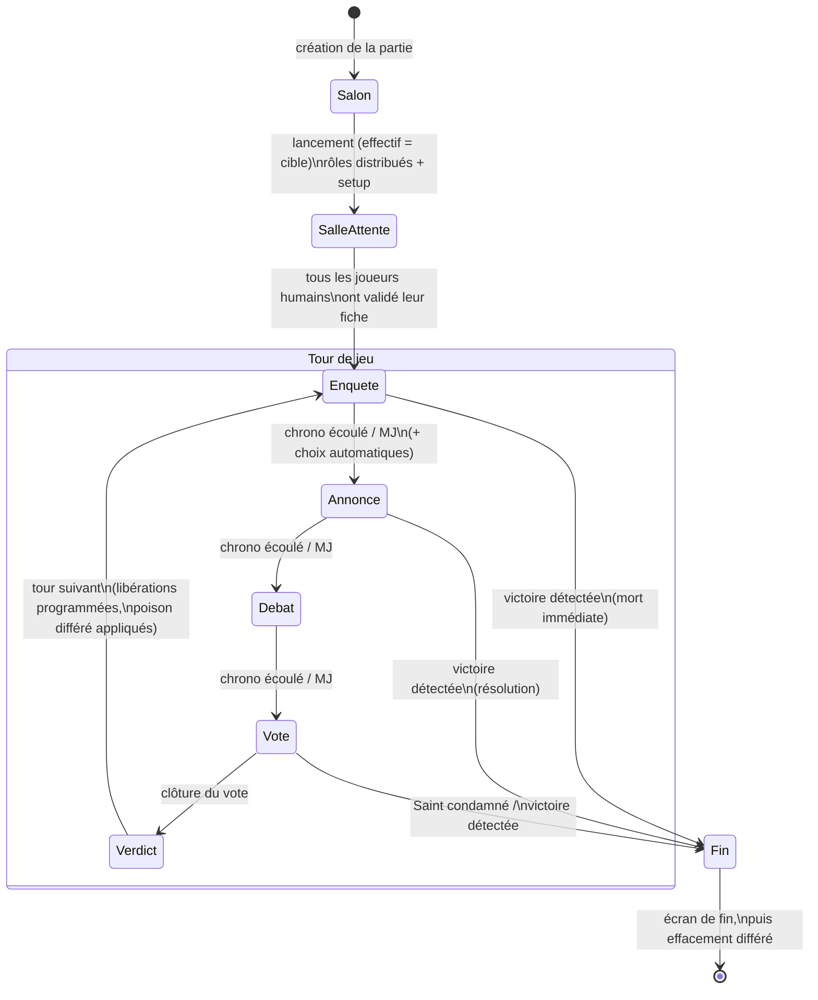

# 05 — Phases et transitions

## Vue d'ensemble

Un tour = **Enquête → Annonce → Débat → Vote**, dans cet ordre, sans retour en arrière. Les phases Enquête, Débat et Vote s'ouvrent par une **transition** plein écran (~3 s) pendant laquelle le chrono ne tourne pas ; l'Annonce s'affiche sans transition et son chrono part immédiatement. La phase Vote se clôt par un **écran de verdict** (~8 s) avant le tour suivant. `CONFIRMÉ`

**Autorité d'avancement** :
- **Mode Joueur Only** : l'avancement est automatique à l'échéance du chrono. La source d'autorité est un **arbitre côté serveur** (cadence ~5 s) qui garantit la progression même si tous les téléphones sont inactifs ; les appareils au premier plan peuvent déclencher la transition à la frontière exacte, sous un **verrou exclusif** garantissant qu'une transition n'est exécutée qu'une seule fois. Un rattrapage borné (6 transitions max d'un coup) résorbe un retard accumulé. `CONFIRMÉ`
- **Mode MJ** : le MJ avance chaque phase à la main (« Lancer le dénouement », « Ouvrir le Débat », « Lancer le vote », « Clore le vote », « Tour suivant ») ; le chrono est informatif (montant). Les boutons passent par le même verrou (pas de double résolution si un clic tombe sur une frontière). `CONFIRMÉ`
- **Pause** : un drapeau de pause suspend l'avancement (bouton MJ ; disponibilité côté Joueur Only `À CONFIRMER`).

**Durées** : Enquête, Débat et Vote sont configurables au salon (défaut 30 s chacune ; Vote ≥ 25 s) ; l'Annonce est fixe (~10 s).

---

## Fiche : ENQUÊTE

| Attribut | Valeur |
|---|---|
| **Objectif** | Fenêtre d'action secrète : capacités et objets. |
| **Déclencheur** | Début de tour (après le verdict du tour précédent, ou l'entrée en partie au tour 1). |
| **Durée / fin** | Durée configurée (défaut 30 s) après la transition ; ou clôture manuelle du MJ. |
| **Joueurs actifs** | Vivants libres (capacité + 1 objet max). Le Geôlier peut ouvrir un parloir ; certains rôles agissent depuis la prison ou la mort uniquement si leur règle le prévoit (cas rares — `À CONFIRMER`). |
| **Joueurs passifs** | Morts (observent, chattent au Conseil), prisonniers (observent ; répondent au parloir s'il est ouvert). |
| **Actions disponibles** | Jouer sa capacité (selon limites), utiliser un objet, répondre à un pacte, écrire testament/notes, consulter tout. |
| **Informations publiques** | Aucune nouvelle — la phase est muette publiquement. |
| **Informations privées** | Résultats immédiats des capacités d'information « au clic » (verdicts, trios…), bandeau d'équipe méchante (cible du Tueur), demandes de pacte, parloir. |
| **Événements possibles** | Duel de dés (résultat montré aux deux protagonistes), exécution d'un prisonnier (mort immédiate + révélation publique du rôle — seule fuite publique pendant l'Enquête). |
| **Transition sortante** | → Annonce. Avant la bascule : choix automatiques des rôles à décision obligatoire non validée. |
| **Interruption** | Fin de partie possible si une mort immédiate (exécution) déclenche une condition de victoire. |
| **Responsabilité MJ** | Clore l'Enquête (avec avertissement si des joueurs n'ont pas agi : ils subiront les choix automatiques prévus par leurs règles). |

## Fiche : ANNONCE

| Attribut | Valeur |
|---|---|
| **Objectif** | Résoudre toutes les intentions et publier les dénouements (la « Gazette »). |
| **Déclencheur** | Fin d'Enquête. |
| **Durée / fin** | ~10 s, non configurable, sans transition d'entrée. En Mode MJ : le MJ enchaîne à la main. |
| **Joueurs actifs** | Personne (lecture seule). |
| **Actions disponibles** | Lire ; acquitter ses modales privées. |
| **Traitements du jeu** | Dans l'ordre : effacements du Cleaner (pré-traitement) → résolution par couches (protections/soins → attaques → poison/morsure) → confirmation des morts différées → cascades (autopsies, amoureux, successions…) → vérification de fin de partie. Les libérations programmées et le poison létal différé s'appliquent au basculement de tour. |
| **Informations publiques** | Dépêches : morts (pseudo + faction, ou « effacé »), emprisonnement (du vote précédent), libérations, événements anonymes (morsure, éveil du Chasseur, miaulement, indices en circulation), exécutions (rôle complet). |
| **Informations privées** | Modales personnelles (mort, survie, morsure, éveil…), dénouement de sa propre capacité, autopsie (Médecin légiste), notifications de rôle (Saint, Armurier, Aubergiste…). |
| **Transition sortante** | → Débat. |
| **Interruption** | Fin de partie dès qu'une condition de victoire devient vraie pendant la résolution ; les intentions restantes sont annulées. |

## Fiche : DÉBAT

| Attribut | Valeur |
|---|---|
| **Objectif** | Discussion en personne : recouper la Gazette, accuser, se défendre. |
| **Déclencheur** | Fin d'Annonce. |
| **Durée / fin** | Durée configurée (défaut 30 s) ; en pratique la table peut la régler bien plus longue. Fin au chrono ou clôture MJ. |
| **Joueurs actifs** | Tous — mais **à la table**, pas dans l'application. |
| **Actions disponibles dans l'app** | Consultation uniquement (Annonces, mur des suspicions, inventaire en lecture — les objets ne s'utilisent pas hors Enquête). Aucune capacité. |
| **Informations publiques** | Rien de nouveau. |
| **Événements possibles** | Morts immédiates par cascade exceptionnelle uniquement ; aucun événement standard. |
| **Transition sortante** | → Vote. |
| **Responsabilité MJ** | Animer le débat, puis lancer le vote. |

## Fiche : VOTE

| Attribut | Valeur |
|---|---|
| **Objectif** | Désigner collectivement un joueur à emprisonner. |
| **Déclencheur** | Fin de Débat. |
| **Durée / fin** | Durée configurée (min 25 s) ; ou clôture MJ. Puis écran de verdict (~8 s). |
| **Joueurs actifs** | Vivants libres : un vote secret, modifiable jusqu'à la clôture, abstention possible. |
| **Joueurs passifs** | Morts et prisonniers : écran d'exclusion avec compteur de participation. |
| **Règles de dépouillement** | Classique : plus voté emprisonné ; **égalité tranchée au sort** ; aucun vote → personne. Variante Suspicion : dépouillement automatique des marques « Suspect » (murs des vivants **et des prisonniers**) ; **égalité → personne**. |
| **Informations publiques** | Compteur de participation (N/M ont voté) pendant la phase ; verdict final (qui part en prison, et si l'égalité a été tranchée au sort) — jamais le détail des bulletins, jamais rôle/faction du condamné. |
| **Informations privées** | Son propre vote ; pour les Méchants : marquage « allié » sur leurs complices. |
| **Événements possibles** | Condamnation du **Saint** → fin de partie immédiate (victoire Méchants). Piège de la **Veuve noire** : si un « époux » désigné a voté contre elle, les deux époux meurent à la prochaine Annonce. |
| **Transition sortante** | → verdict (~8 s) → tour suivant (Enquête). |
| **Responsabilité MJ** | Ouvrir puis clore le vote. |

---

## Diagramme des phases et transitions

## Cas où plusieurs transitions semblent possibles

- **Fin de partie vs poursuite** : la vérification de victoire peut interrompre n'importe quelle phase ; elle **prime toujours** sur la transition normale.
- **Rattrapage multiple** : après une longue inactivité générale, plusieurs transitions dues sont enchaînées d'un coup (borné), l'état final présenté étant la phase réellement courante.
- **Aucun retour en arrière** n'existe : ni phase rejouée, ni annulation de verdict.
